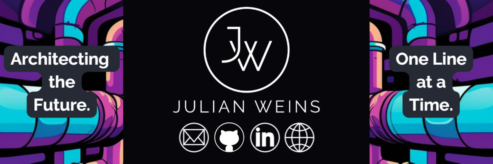

## 👋🏽 Hi there, I am Julian Weins
I am a DevOps Engineer dedicated to optimizing the software development lifecycle, ensuring efficient provisioning, seamless containerization, reliable deployment, and robust monitoring. My experience in ML, AI, and stream processing adds depth to my skills.

Please feel invited to connect with me:

  

## 💪🏽 My Stats

  
  

## 👍🏽 OSS Contributor
- Proud to be a contributor to 💜[airbyte](https://airbyte.com/) in 2022
- Looking forward to help developing [OpenToFu](https://opentofu.org/) in 2023

## ⚡ Domains:
- DevOps:               (🟣Terraform, 🔥Prometheus and 🐋Docker)
- Software Engineering: (🐍Python, 🦀Rust and 📘Go)
- Cloud Platform:       (💙Azure)

## 📖 Study:
- Currently exploring Networking ultimately leading to Azure Network Engineer AZ-700

## 📘 Background:
- Bachelor of Science in Business Information Systems
- Strong SAP HANA & SAP BW history

## ⚠️ Important:
- I really like dogs 🐕

